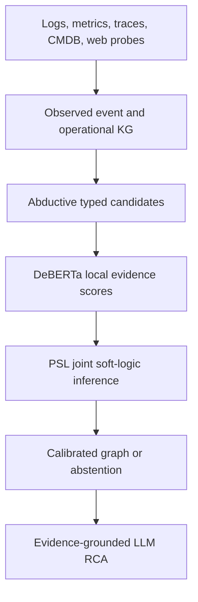

# LogAgent

**Uncertainty-Aware Operational Topology Completion for Graph-Grounded LLM Root Cause Analysis under Observability Blind Spots**

LogAgent studies a practical failure mode in AIOps: collectors, web crawlers, APM agents, traces, and CMDB exports provide only a partial and sometimes inconsistent view of the operational topology. The project recovers *candidate* missing relations with calibrated uncertainty and tests whether those relations improve root-cause and impact-path analysis.

> Research status: protocol and data-readiness phase. This repository does not yet claim that DeBERTa or PSL improves relation recovery or RCA.

## Precise research scope

This work does **not** claim to generate an ontology schema from logs. We keep a reviewed TBox/schema fixed and study:

1. operational ABox/KG population from heterogeneous telemetry;
2. missing-relation completion on a fixed entity set;
3. downstream RCA improvement caused by the completed graph.

Open-set entity discovery and cross-source entity resolution are tracked as later extensions so that link recovery, entity discovery, and RCA are not conflated in the first paper.

## Proposed pipeline



- **Abduction** proposes typed relations that could explain observations.
- **DeBERTa NLI** scores local entailment and contradiction from evidence bundles.
- **PSL** combines soft rules and evidence into soft truth values. It is not a formal proof engine.
- **The LLM** returns a root component, cause path, impact path, evidence IDs, confidence, and an abstention decision.

Initial relation vocabulary includes `CALLS`, `INSTANCE_OF`, `EXPOSES`, `ROUTES_TO`, `USES_DATASOURCE`, `EXECUTES`, and `LOCATED_ON`.

## Evaluation is split into two tasks

| Task | Question | Primary outputs |
|---|---|---|
| A — relation recovery | Were masked operational edges recovered without unsafe false edges? | typed edge F1/AUPRC, Hits@k, calibration, risk-coverage, path distortion |
| B — RCA intervention | Does the recovered graph causally improve RCA over the partial graph? | root Top-k/MRR, cause-path F1, impact F1, evidence faithfulness, cost |

The comparison matrix includes raw-telemetry LLM, partial-KG LLM, abduction only, abduction + DeBERTa, abduction + DeBERTa + PSL, full-graph oracle, wrong-edge stress tests, and a graph-free blind-spot baseline.

## Data strategy

No benchmark is treated as sufficient on its own.

- **Primary realistic RCA corpus:** RCABench/Aegis TrainTicket with validated injections and Kubernetes-rich logs, metrics, and traces.
- **Reproducibility and cross-system baseline:** RCAEval RE2/RE3, using case-level Hugging Face access for smoke tests and checksummed Zenodo archives for frozen runs.
- **Exact topology-masking control:** DejaVu fault-dependency graphs; metrics-only, so it cannot validate text relation extraction.
- **Event-KG extraction:** OntoLogX AIT annotations.
- **Topology and multi-source auxiliaries:** Nezha, LO2v2, GAIA, Eadro, and Multi-Source OpenStack.
- **External RCA validation:** OpenRCA and LEMMA-RCA, subject to storage and data-license gates.

Every dataset is registered with an access method, expected modalities, ground truth, license status, size, and readiness gate. Raw datasets are never committed.

## Quick start

```bash
python tools/datasets.py catalog
python tools/datasets.py audit
python tools/datasets.py plan rcaeval --profile smoke
python tools/datasets.py plan rcabench_aegis --profile artifact_smoke
python -m unittest discover -s tests
```

A download requires an explicit dataset, profile, destination, and confirmation flag. Large or license-ambiguous datasets remain plan-only until their gate is cleared.

## Research controls

- Random edge masks at 20/40/60% are retained only for comparability.
- Primary masks model real blind spots: node/collector blackout, relation-type loss, trace dropout, identity-link loss, and time-window loss.
- Ground-truth topology must come from held-out deployment manifests, service code, or complete traces that are not exposed as model evidence.
- Unknown edges are not automatically treated as negatives; evaluation uses typed candidates and positive-unlabeled/open-world controls.
- Five masking seeds, system-level holdouts, paired significance tests, and calibration reporting are mandatory.

See [the research protocol](docs/research_protocol.md) and [dataset readiness matrix](docs/dataset_readiness.md).

## Related work boundary

[OntoLogX](https://github.com/LucaCtt/ontologx) is used as a strong front-end/event-KG baseline: it populates a fixed ontology from logs, but does not recover missing operational topology or evaluate RCA paths. [TORAI](https://arxiv.org/abs/2604.13522) is a critical graph-free baseline because it targets RCA under call-graph blind spots without reconstructing the graph.

## Working branch

Research scaffolding is developed on `research/reference-matrix-readiness`. The default branch remains untouched until the data and protocol gates are reviewed.

## Executable RCAEval smoke

The first leakage-controlled vertical run is now executable: checksummed acquisition, standard incident conversion, whole-trace held-out silver graph, L1 structural masking, and A0--A5 recovery.

- 6,475 traces were split into 2,539 evaluator-only and 3,936 model traces with zero overlap.
- The held-out runtime graph contains 55 `CALLS` edges: 52 attestation A and 3 attestation B.
- A2 recovered every masked target in IID 20/40/60% and component-blackout smoke conditions.
- Off-the-shelf DeBERTa-only A3 failed: it over-predicted 1,272 edges and recovered none of the masked targets.
- A5 reduced unverified additions in the IID smoke, but this is one incident and one seed, not a paper claim or an RCA result.

Run:

```bash
python tools/run_rcaeval_smoke.py \
  --output outputs/rcaeval_smoke/run
```

Real DeBERTa/PSL backends are optional and are marked `SKIPPED` when unavailable; mock or lexical substitutes are never labeled as A3--A5. See [the executable contract](docs/rcaeval_smoke_experiment.md) and [measured smoke results](reports/rcaeval_smoke_results.md).

